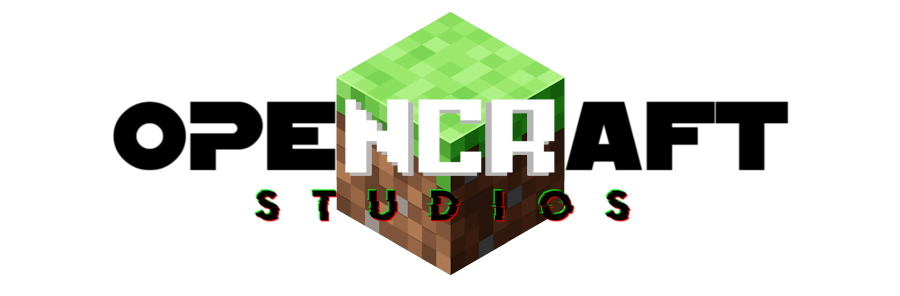

[![Contributors][contributors-shield]][contributors-url]
[![Forks][forks-shield]][forks-url]
[![Stargazers][stars-shield]][stars-url]
[![Issues][issues-shield]][issues-url]
[![MPL License][license-shield]][license-url]

[![Discord][discord-shield]][discord-url]
[![Reddit][reddit-shield]][reddit-url]

  

  
  
  

    A cool sandbox game.
      
    <a href="https://github.com/OpenCraft-Studios/opencraft/wiki">
      <b>Explore the docs »</b>
    </a>
     
    <a href="https://github.com/OpenCraft-Studios/opencraft/issues/new?template=bug.yml">🐛 Report Bugs</a> ·
    <a href="#-building">🛠️ Building</a> ·
    <a href="https://github.com/OpenCraft-Studios/opencraft/issues/new?template=feature.yml">💡 Suggest Features</a>
	  
	⭐ Star us on GitHub — it motivates us a lot!
  

> [!CAUTION]
> OpenCraft is not affiliated with (or supported by) Mojang AB, Minecraft, or Microsoft in any way.  
> It will never support Minecraft accounts or modern Minecraft servers.

 

## ☁️ Overview
**OpenCraft** is a **Minecraft clone** made with voxels that have that classical blocky look.
It is coded in the C language. Uses GLFW and a custom graphical library (WIP).

- 💸 **Completely free**                 — and open-source for everyone to mess with it!  
- 🎨 **Fully customizable and moddable** — no restrictions.  
- ⚡ **Optimized for performance**       — no unnecessary bloat.  
- 👪 **Community-driven**                — where anyone can contribute ideas and improvements.  

### Why even bother?
Other similar games have a closed-source project with strict licenses. While they can be decompiled, modifying and redistributing a modified version is illegal. OpenCraft aims to be a alternative where anyone can modify and distribute their own version without legal issues.

### 🤝 Contact us
[][discord-url]

 

## 🛠️ Building
Everything about building is in the wiki to make this README shorter.

 

## ⚖️ License
Some basic advices to prevent impersonation, promote safety and always encourage the downloading from official mirrors:

##### **You CAN:**
- ✔️ **Modify** — OpenCraft *(textures, code, mechanics, etc.)*. 
- ✔️ **Distribute** — your modifications. 

##### **You MUST NOT:**
- ❌ **Sell** — the game or its modifications. 
- ❌ **Impersonate** — the original creators. 
- ❌ **Malware** — Add malware or malicious code to forks or derivative versions. 
- ❌ **License** — Change the license document. 

 

🔹 **You must always give credit to the original authors.**  
🔹 The full license can be found at [OCPL-1.0][license-url].

## 👷‍♂️ Contributors
|  |  |
|:-----------------------------------------------------------------------------------------------:|:---------------------------------------------------------------------------------------------------:|
|                       **CiroZDP**   *(Founder & Developer)*                                |                     **The Community**   *(Contributors & Testers)*                             |

 

💡 **Want to help?** You can contribute with code or ideas.

[reddit-shield]: https://img.shields.io/badge/Reddit-FF4500?style=for-the-badge&logo=reddit&logoColor=white
[reddit-url]: https://www.reddit.com/r/OpenCraftMC/
[discord-shield]: https://img.shields.io/badge/Discord-%235865F2.svg?style=for-the-badge&logo=discord&logoColor=white
[discord-url]: https://discord.gg/bSMtp3DZz8
[contributors-shield]: https://img.shields.io/github/contributors/OpenCraft-Studios/opencraft.svg?style=for-the-badge&logo=github
[contributors-url]: https://github.com/OpenCraft-Studios/opencraft/graphs/contributors
[forks-shield]: https://img.shields.io/github/forks/OpenCraft-Studios/opencraft.svg?style=for-the-badge&logo=github
[forks-url]: https://github.com/OpenCraft-Studios/opencraft/network/members
[stars-shield]: https://img.shields.io/github/stars/OpenCraft-Studios/opencraft.svg?style=for-the-badge&logo=github
[stars-url]: https://github.com/OpenCraft-Studios/opencraft/stargazers
[issues-shield]: https://img.shields.io/github/issues/OpenCraft-Studios/opencraft.svg?style=for-the-badge&logo=github
[issues-url]: https://github.com/OpenCraft-Studios/opencraft/issues
[license-shield]: https://img.shields.io/badge/OCPL--1.0-green?style=for-the-badge&logo=github&label=LICENSE
[license-url]: https://github.com/OpenCraft-Studios/opencraft/blob/master/LICENSE.md
