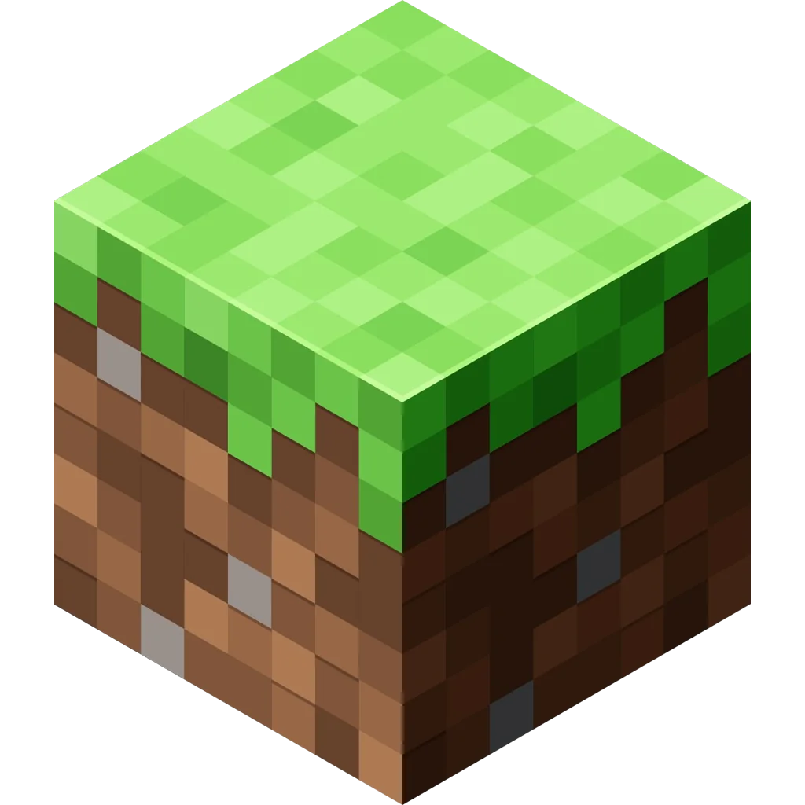

[![Contributors][contributors-shield]][contributors-url]
[![Forks][forks-shield]][forks-url]
[![Stargazers][stars-shield]][stars-url]
[![Issues][issues-shield]][issues-url]
[![MPL License][license-shield]][license-url]

[![Discord][discord-shield]][discord-url]
[![Reddit][reddit-shield]][reddit-url]

  

https://gitlab.com/opencraft-studios/opencraft.git
  

  <h3>OpenCraft</h3>

  

    A cool sandbox game.
      
    <a href="https://gitlab.com/opencraft-studios/opencraft/-/wikis/home">
      <b>Explore the docs »</b>
    </a>
     
    <a href="https://gitlab.com/opencraft-studios/opencraft/-/issues/new">🐛 Report Bugs</a> ·
    <a href="#-download">📥 Download</a> ·
    <a href="https://gitlab.com/opencraft-studios/opencraft/-/issues/new">💡 Suggest Features</a>
  

 

> [!WARNING]
> **OpenCraft is not affiliated with (or supported by) Mojang AB, Minecraft, or Microsoft in any way.**  
> **It will never support Minecraft accounts or modern Minecraft servers.**

## 🚀 Getting started
**OpenCraft** is a Minecraft clone made with voxels that have that classical blocky look.
It is coded in the C language. Uses **GLFW** and a custom graphical library (WIP).

🔹 **Completely free** and open-source.  
🔹 **Fully customizable and moddable** without restrictions.  
🔹 **Optimized for performance**, no unnecessary bloat.  
🔹 **Community-driven**, where anyone can contribute ideas and improvements.  

### 🎯 Why was this project created?
Other similar games have a closed-source project with strict licenses. While they can be decompiled, modifying and redistributing a modified version is **illegal**.

OpenCraft aims to be a **free and open alternative** where anyone can modify and distribute their own version without legal issues.

💙 **Like the idea? Support us with a ⭐ on GitLab!**

 

## ⬇️ Download
> **Coming soon...**

🔧 **We want OpenCraft to be as polished as possible before releasing a playable version!**  
If you want to help, check out our code or join the community.

[ <a href="#-getting-started">↑ Back to top ↑</a> ]

 

## ⚖️ License
#### **You CAN:**
✔️ Modify OpenCraft (textures, code, mechanics, etc.). 
✔️ Distribute your modifications (without impersonating the original authors). 
✔️ Credit yourself for your version (while giving credit to the original authors). 

#### **You MUST NOT:**
❌ Sell the game or its modifications. 
❌ Alter the license document. 
❌ Add malware or malicious code to forks or derivative versions. 
❌ Impersonate the original creators. 

🔹 **You must always give credit to the original authors.**  
🔹 The full license can be found at [BSD 3.0][license-url].

[ <a href="#-getting-started">↑ Back to top ↑</a> ]

---

## 👷‍♂️ Contributors
|  |  |
|:-----------------------------------------------------------------------------------------------:|:-------------------------------------------------------------------------------------------------:|
| **CiroDOS** *(Founder & Developer)* | **The Community** *(Contributors & Testers)* |

 

💡 **Want to help?** You can contribute with code, ideas, or simply by leaving a ⭐ on GitLab.

[ <a href="#-getting-started">↑ Back to top ↑</a> ]

---

[reddit-shield]: https://img.shields.io/badge/Reddit-FF4500?style=for-the-badge&logo=reddit&logoColor=white
[reddit-url]: https://www.reddit.com/r/OpenCraftMC/
[discord-shield]: https://img.shields.io/badge/Discord-%235865F2.svg?style=for-the-badge&logo=discord&logoColor=white
[discord-url]: https://discord.gg/bSMtp3DZz8
[contributors-shield]: https://img.shields.io/gitlab/contributors/opencraft-studios%2Fopencraft?style=for-the-badge
[contributors-url]: https://gitlab.com/opencraft-studios/opencraft/-/project_members
[forks-shield]: https://img.shields.io/gitlab/forks/opencraft-studios%2Fopencraft.svg?style=for-the-badge
[forks-url]: https://gitlab.com/opencraft-studios/opencraft/-/forks/new
[stars-shield]: https://img.shields.io/gitlab/stars/opencraft-studios%2Fopencraft.svg?style=for-the-badge
[stars-url]: https://gitlab.com/opencraft-studios/opencraft/-/starrers
[issues-shield]: https://img.shields.io/gitlab/issues/open-raw/opencraft-studios%2Fopencraft?style=for-the-badge
[issues-url]: https://gitlab.com/opencraft-studios/opencraft/-/issues
[license-shield]: https://img.shields.io/gitlab/license/opencraft-studios/opencraft.svg?style=for-the-badge
[license-url]: https://gitlab.com/opencraft-studios/opencraft/-/blob/master/LICENSE.txt?ref_type=heads
